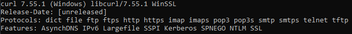
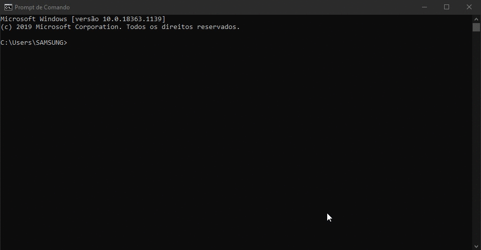
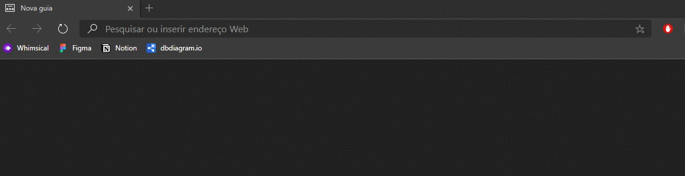
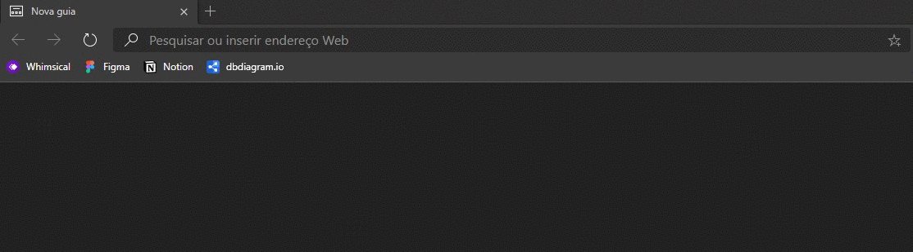
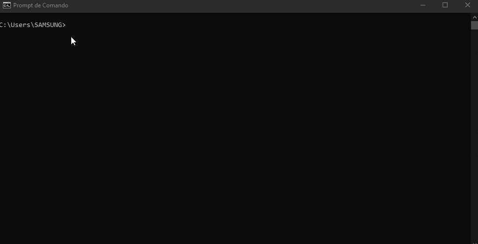
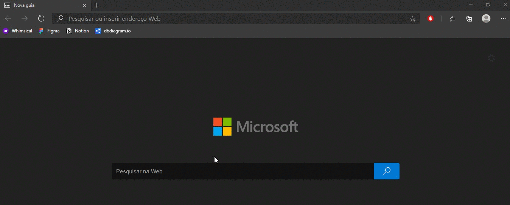
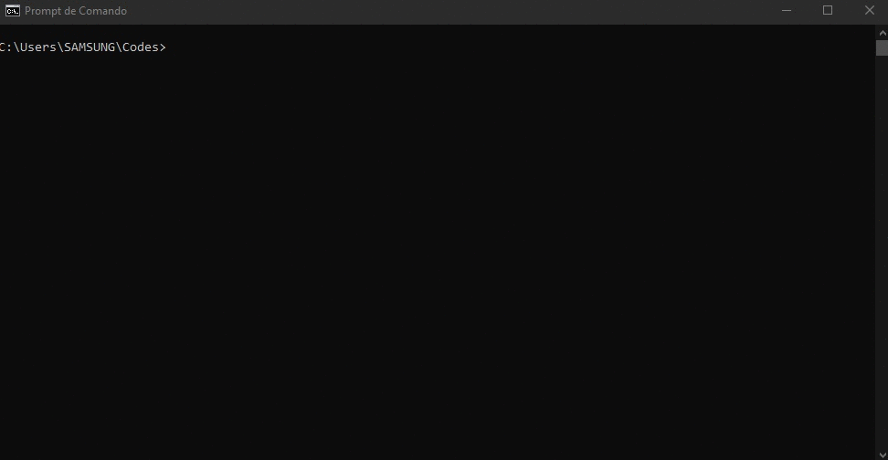
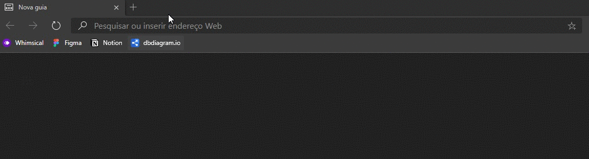
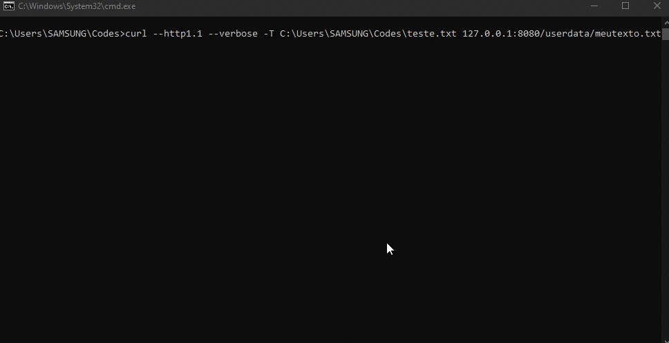
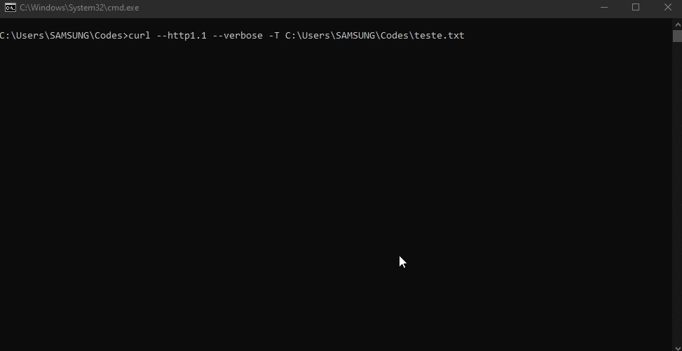

# Projeto HTTP 1.1

## O que o servidor pode fazer

- [x]  Fazer requisição do tipo GET para o servidor.
  - [x]  Retorna um arquivo (se existir) do tipo: .html, .jpeg, .jpg, .png e .gif.
  - [x]  Se o arquivo não existir, o erro 404 é mostrado (juntamente com um corpo).
- [x]  Fazer a requisição utilizando o PUT
  - [x]  Informar para o cliente continuar enviando dados (100 Continue)
  - [x]  Criar arquivo caso não exista no servidor (201 created)
  - [x]  Criar o arquivo caso não exista, mas também não existe corpo (204 No Content)
  - [x]  Se o cliente quiser inserir em qualquer diretório que não seja o "userdata" retornar 301 Moved.
- [x]  Tratamentos mais gerais.
  - [x]  Erro do cliente: 400 BadRequest.
  - [x]  Erro do servidor: 505 HTTPVersionNotSupported.

## Instruções para uso

### Instalação do cURL

Antes de verificar as instruções é necessário que seu computador possua o [cURL](https://curl.haxx.se/), um software open source  utilizado em scripts ou linhas de comando para transferir dados. Esse software suporta a transferência de arquivos seguindo diversos tipos de protocolos, entre eles, o protocolo HTTP requisitado no trabalho.

Para verificar se seu computador possui o cURL, basta digitar no terminal ou CMD o comando "curl —version". Se existe o software disponível, você receberá uma mensagem como na figura 1.



Figura 1: Resposta ao curl —version

Caso não possua, é possível instalar rapidamente utilizando os comandos:

sudo apt install curl - Para distribuições como Ubuntu.

pacman -Sy curl - Para distribuições como o ArchLinux.

yum install curl - Para distribuições como Fedora/CentOS.

Ou, caso esteja utilizando o sistema operacional Windows, é possível instalar o executavel a partir da [página de download do cURL](https://curl.haxx.se/download.html).

Após instalar o cURL e certificar que o mesmo está executando corretamente, é possível testar o servidor.

### Servidor HTTP

O diretório raiz possui:

4 arquivos .py correspondentes à funcionalidade do servidor.

1 arquivo .html correspondente à página base do servidor.

1 diretório chamado userdata que armazenará os dados enviados pelo cliente ao servidor à partir de uma requisição do tipo PUT.

O arquivo que deverá ser mantido em execução é o **ServerMain.py**, os demais arquivos presentes no diretório raiz são funções auxiliares para que todas as requisições sejam atendidas corretamente. O servidor escuta na porta 8080 do localhost (127.0.0.1), qualquer outra porta utilizada para o contatar não
funcionará. Caso deseje outra porta, a partir do arquivo ServerMain.py é possível alterar a variável “self.PORTA”, na linha 6, para a porta desejada.

### Adquirindo objetos do servidor a partir do método GET

O GET pode ser realizado de duas formas, com o cURL e pelo próprio navegador.

As respostas podem variar de acordo com a disponibilidade do arquivo no diretório requisitado, erros de sintaxe ou até mesmo a versão do http utilizado na requisição.

De forma geral, a sintaxe do GET (caso utilizando o cURL) será:

```bash
curl --http1.1 --verbose 127.0.0.1:8080/<objeto_buscado>
```

O grupo recomenda utilizar as tags --http1.1 para garantir o uso da versão correta requisitada no projeto e o --verbose para analisar com detalhes como a requisição e respostas foram estruturadas e enviadas.

Um exemplo é dado no gif abaixo, no qual é requisitado o root "/".



O mesmo resultado pode ser alcançado através do navegador.



Caso seja feita a requisição de um recurso não existente, o erro 404 Not Found será mostrado no terminal ou browser (dependendo a origem da requisição).



Entre as demais mensagens tratadas, pode-se verificar os erros de Bad Request e Http Version Not Support através do cURL.

Como o BadRequest só é mostrado caso o cliente insira uma sintaxe incorreta (como no caso de métodos que o servidor não suporta, ou até mesmo que não existam), utiliza-se o cURL com o parâmetro -X seguido de um método aleatório, e a resposta esperada será mostrada.



É possível também visualizar o erro de HTTP Version Not Supported trocando a tag --http1.1 para --http1.0 por exemplo.

Vale lembrar que o servidor, em arquivos existentes no diretório, só retorna o corpo se o arquivo for de algum dos tipos: .html, .txt, .md, .png, .jpg, .jpeg e .gif.

Por exemplo, ao requisitar uma imagem que existe no servidor, e possui a extensão disponível, tem-se a resposta correta.



### Colocando arquivos no servidor com o método PUT

A escolha para inserir objetos no servidor foi utilizar o métiodo PUT. Para esse processo, será necessário ter o cURL em mãos.

O comando de inserção é simples:

```bash
curl --http1.1 --verbose -T <diretorio+arquivo> 127.0.0.1:8080/userdata/<nome_do_arquivo> 
```

A tag -T serve para o upload de arquivos em um dado url.

É necessário seguir a composição do arquivo de upload informando todo o caminho até o arquivo.

Já o destino do upload será sempre o 127.0.0.1:8080/userdata. Esse diretório é tratado pelo servidor como o destino de todo arquivo inserido pelo método PUT.



Para verificar se o dado foi corretamente inserido, podemos realizar um GET.



De acordo com a RFC 2616, caso um arquivo requisitado já exista no servidor, o PUT deve o sobrescrever e a resposta deve ser 200 OK caso o conteúdo seja alterado, ou 204 No Content caso o novo arquivo não possua nenhum dado. Então, ao refazer o mesmo PUT, a resposta esperada é 200 OK, pois o arquivo já existe no servidor e o documento enviado possui dados em sua composição.



Agora, se o cliente desejar inserir em qualquer diretório que não seja o "userdata", o servidor irá encarregar-se de criar o arquivo na pasta correta e responder com o código 301, avisando ao usuário que seu recurso foi criado, mas não no url informado.




