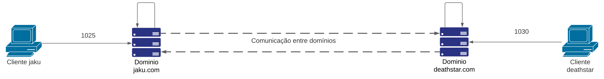

# Servidor SMTP

## 1. Introdução
O presente repositório possui uma implementação de um cenário no seguinte esquema:

Tanto os clientes como os domínios foram criados utilizando a linguagem Python. Para o cliente foi utilizado o módulo [smtplib](https://docs.python.org/3/library/smtplib.html) e para o servidor SMTP, o módulo [smtpd](https://docs.python.org/3/library/smtpd.html).

### 1.1. Considerações
Perceba que a comunicação entre dois domínios, no mundo real, é bem mais complexa que a apresentada no esquema.
Entretanto, para a tarefa em questão, a comunicação entre ambos domínios envolve um *pseudo-DNS*, isso é, não foi implementado um servidor dedicado, seguindo o protocolo, apenas a ideia (resolver nomes de domínio) foi implementado dentro do método de *process_message* dos servidores SMTP, o que garante, de certa forma, a comunicação entre ambos domínios.

## 2. Instruções para uso
### 2.1. Preparando o ambiente
É necessário que sua máquina possua o módulo [Tkinter](https://docs.python.org/3/library/tk.html) do Python para a correta execução de um dos clientes. <br/>
Para verificar, é possível executar os seguintes comandos no terminal ou no próprio IDLE do Python:
```python
import tkinter
tkinter._test()
```
Caso o Tkinter esteja instalado em sua máquina, um *dialog* confirmando a versão do Tcl/Tk.<br/>
Caso encontre erros, você pode instalar o Tkinter em sua máquina.
1. Em sistemas com Windows e Packager Installer for Python (pip) é possível aplicar o comando no CMD/Terminal: **pip install tk**
2. Em sistemas Linux, dependendo de sua distro é possível instalar através do Packager Manager, como por exemplo: **sudo pacman -S tk** para ArchLinux ou **sudo apt install python3-tk** para Ubuntu.

### 2.2. Ligando servidores
O primeiro passo após configurar o ambiente é executar os servidores, dados pelos arquivos **server.py**, dentro dos diretórios smtp.jaku e smtp.deathstar.
Após isso, você verá um print no terminal de cada servidor indicando que o domínio está sendo executado.<br/>
Os dados enviados para os domínios ficarão salvos no diretório, um arquivo chamado **ServerMSG.txt** aramzenará todo o corpo da mensagem, contendo campos como remetente, destinatário(s), título, assunto e conteúdo do email. Já os anexos que podem ser enviados, ficarão armazenados também no diretório.<br/><br/>
O domínio **jaku** esperará mensagens no localhost:1025. E, o domínio **deathstar** esperará mensagens no localhost:1030.
 
### 2.3. Clientes
Assim como os domínios, existem dois clientes, esses, para funcionar, necessitam que as etapas anteriores sejam feitas corretamente.<br/>
#### 2.4. Cliente "Hardcoded"
Um dos clientes é o **clientHardcoded.py** que como o próprio nome diz possui todas as informações da mensagem fixas em código, sendo necessário somente executar o arquivo para visualizar o funcionamento e comunicação entre os domínios. <br/>
Esse cliente, além da mensagem em texto no e-mail, também envia três anexos de três extensões diferentes: uma imagem .jpeg, um gif e um arquivo de texto.<br/> 
#### 2.5. Cliente "Input"
O outro cliente disponível para uso é o **clientInput.py**, esse, diferentemente do primeiro apresentado, permite que o usuário insira os dados do e-mail, bem como o anexo desejado para o envio.